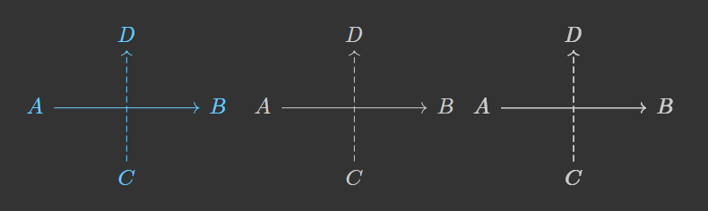

This is Brkhu's fork of plugin hexo-filter-tikzjax. He is trying to draw better tikz pictures on transparent backgrounds.

*This fork is specifically created for the theme NexT.*

Three optional parameters are added to the original plugin to support different rendering modes: `mask`, `color` and `scale`. `mask` mode will draw the TikZ picture on a mask layer with inverted colors, and apply it to a colored rectangle which creates a transparent background effect. `color` mode will replace a specified color in the TikZ picture with another color, useful for adapting to light/dark themes. `scale` mode will scale the TikZ picture by a specified factor.

Here are some examples of how to use these new features.

1. Default mode (no `mask`, `color` or `scale`): just use `tikz` as the code block language.

2. Enable `mask` mode by adding `-mask` to the code block language:
    ````markdown
    ```tikz-mask
    \begin{document}
        \begin{tikzpicture}
            % Your code here...
        \end{tikzpicture}
    \end{document}
    ```
    ````

    Sometimes this will produce thicker lines. This mode is designed for black and white pictures using white color as erasers, e.g., commutative diagrams with `crossing over` arrows.

3. Enable `color` mode by adding `-color` to the code block language:
    ````markdown
    ```tikz-color
    \begin{document}
        \begin{tikzpicture}
            % Your code here...
        \end{tikzpicture}
    \end{document}
    ```
    ````

    This mode will replace a specified color in the TikZ picture with another color. By default, it replaces `#6cf` with `var(--text-color)`, which is a CSS variable for text color in NexT-Pisces theme. You can change these colors to fit your needs in `_config.yml`:
    ```yml
    tikzjax:
      color_replacement:
        from: # Use any color you like here. E.g., "#6cf" for #66ccff, and "#39c5bb" for #39c5bb.
        to: # Use CSS variable for text color to adapt to light/dark themes. In NexT-Pisces, it's "var(--text-color)".
    ```
    
    Compared to `mask` mode, this mode will not cause thicker lines, and it works for colored pictures as well.

4. Enable `scale` mode by adding `-scale` or `-scale=...` to the code block language:
    ````markdown
    ```tikz-scale=2
    \begin{document}
        \begin{tikzpicture}
            % Your code here...
        \end{tikzpicture}
    \end{document}
    ```
    ````

    If no number is specified, the default scale factor (1.5x) will be used. One can also set the default scale factor in `_config.yml` as follows:
    ```yml
    tikzjax:
      scale: # Your default scale factor
    ```

<!-- 4. Combine both `mask` and `scale` modes by using `mask-scale(=...)`. Notice the order of `mask` and `scale` in the code block language matters, `-tikz-scale(=...)-mask` is not supported. -->

Notice that these modes can be combined in following way: `tikz-mask-scale(=...)`, `tikz-color-scale(=...)`.

Here are some comparisons of different modes:


First row: default mode, mask mode, scale mode (1.5x)  
Second row: scale mode (2x), mask + scale mode (2x)



First row: scale mode (1.5x), color + scale mode (1.5x), mask + scale mode (1.5x)

---

# hexo-filter-tikzjax

[](https://www.npmjs.com/package/hexo-filter-tikzjax)
[](LICENSE)

Server side [PGF/Ti*k*Z](https://tikz.dev) renderer plugin for [Hexo](http://hexo.io).

Render graphs, figures, circuits, chemical diagrams, commutative diagrams, and more in your blog posts.

No client side JavaScript required. Woo-hoo! 🎉

## Installation

```bash
npm install hexo-filter-tikzjax
```

For the first run after installation, you need to run `hexo clean` to clean the cache.

## Configuration

Configure this plugin in your site's `_config.yml`. Default values:

```yml
tikzjax:
  # Enable TikZ rendering for all posts and pages.
  # Or you can enable it per post by adding `tikzjax: true` to the front-matter.
  every_page: false
  # Add CSS to pages which contain TikZ graphs.
  append_css: true
  # URL of the font CSS file.
  font_css_url: 'https://cdn.jsdelivr.net/npm/node-tikzjax@latest/css/fonts.css'
  # Additional options that will be passed to node-tikzjax.
  # See: https://github.com/prinsss/node-tikzjax/#usage
  # tikzjax_options:
  #   showConsole: false
```

## Usage

Add `tikzjax: true` to the [front-matter](https://hexo.io/docs/front-matter) of posts/pages that you would like to enable Ti*k*Z rendering.

Wrap you Ti*k*Z code in a Markdown code block with language `tikz`, and you are good to go!

````markdown
```tikz
\begin{document}
  \begin{tikzpicture}
    % Your code here...
  \end{tikzpicture}
\end{document}
```
````

Ti*k*Z code are rendered as static SVG images during the Hexo generation process. The SVG images are then embedded into the HTML pages so there is no client side JavaScript involved. The images will be updated automatically when you change the code.

For a full list of supported Ti*k*Z features and $\LaTeX$ packages, please refer to the [node-tikzjax](https://github.com/prinsss/node-tikzjax#usage) documentation.

> [!TIP]
> Run `hexo generate` or `hexo server` with `--debug` option to see the debug messages, including the console output of the TeX engine. To clear the internal SVG cache, run `rm -rf node_modules/hexo-filter-tikzjax/.cache`.

## Example

As this plugin is greatly inspired by [obsidian-tikzjax](https://github.com/artisticat1/obsidian-tikzjax), you can expect the same syntax, features and rendering results.

````markdown
---
title: 'Lorem Ipsum'
date: '2024/01/01 11:45:14'
mathjax: true
tikzjax: true
---

We love using $\LaTeX$ and Ti*k*Z in [Hexo](http://hexo.io)!

```tikz
\begin{document}
  \begin{tikzpicture}[domain=0:4,scale=1.1]
    \draw[very thin,color=gray] (-0.1,-1.1) grid (3.9,3.9);
    \draw[->] (-0.2,0) -- (4.2,0) node[right] {$x$};
    \draw[->] (0,-1.2) -- (0,4.2) node[above] {$f(x)$};
    \draw[color=red]    plot (\x,\x)             node[right] {$f(x) =x$};
    \draw[color=blue]   plot (\x,{sin(\x r)})    node[right] {$f(x) = \sin x$};
    \draw[color=orange] plot (\x,{0.05*exp(\x)}) node[right] {$f(x) = \frac{1}{20} \mathrm e^x$};
  \end{tikzpicture}
\end{document}
```

The above code will be rendered and embedded as an inline SVG image.
````

For more examples, please refer to the [node-tikzjax](https://github.com/prinsss/node-tikzjax/blob/main/demo).


## License

[MIT](LICENSE)
